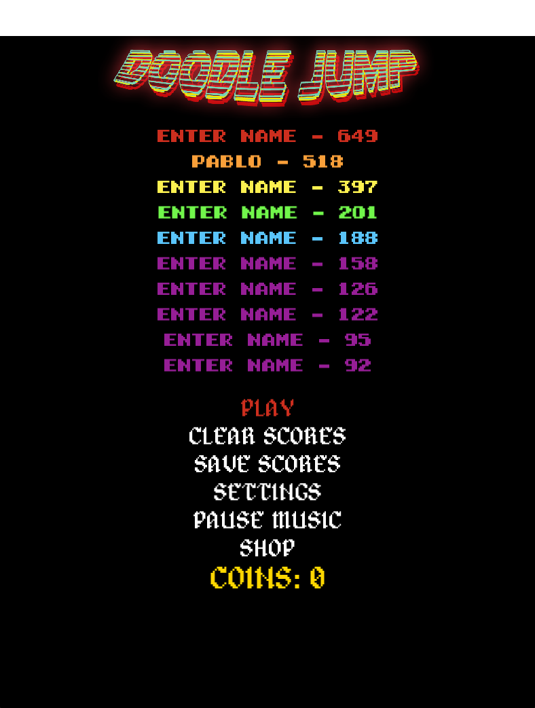
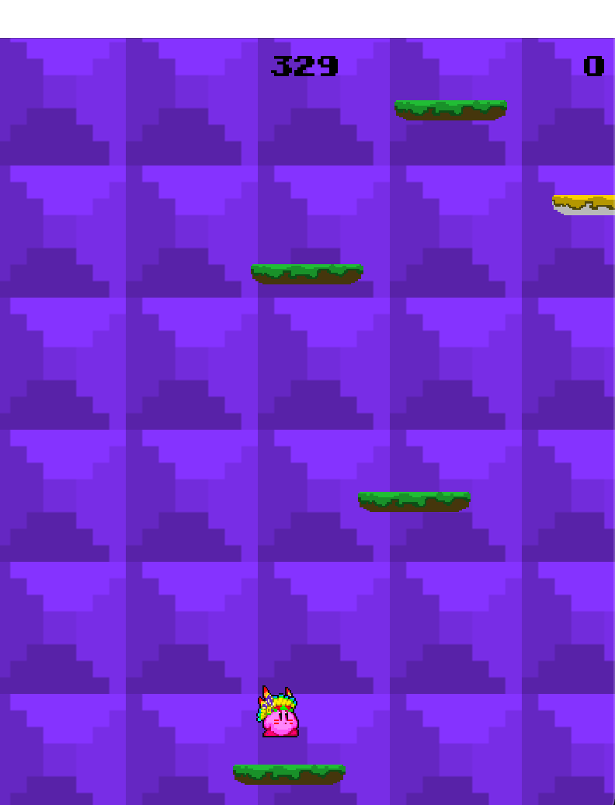
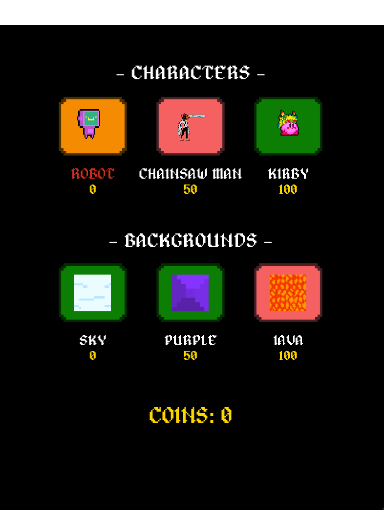

# Advanced-Programming-DoodleJump

Doodle Jump game implemented with SFML from scratch.

# Implementation details

## Model

I made use of the composite pattern when implementing the different entities. The Entity class holds basic members that
are critical for the derived entities. Each derived entity holds its own enumerated type, used to distinguish the
different entities. Jetpack and Spring are bonuses, so they derive from an extra Entity derived subclass called Bonus.
This is mainly done to bypass code duplication and to make use of the Visitor pattern where we shall talk later about.

## Controller

Every entity has its own controller. So a bonus has a BonusController, the player has a PlayerController and a platform
has a PlatformController. These all derive from an abstract controller called:
IController that holds a pointer to the connected Entity employing the Observer pattern. These two are connected inside
the abstract factory.

## View

Just like with the Controller has every type of Entity its own View:
PlayerView, PlatformView, BonusView, ScoreView and BackgroundView. We use these to represent the Model it is connected
to, again using the observer pattern. We make here use of polymorphism to connect the right view to the model because
every model acts differently to for example an out of view event.

## Observer Pattern

The observer pattern is used for communicating between a subject and an observer. When the state of a subject changes it
shall notify/trigger all its registered observers. These observers can all have a different reaction to the trigger sent
by the subject. Therefore I made use of events when triggering observers so that we can also store data in the trigger
that is being sent and have much more free space to react to an event.

## Events

Each observer class that makes usage of custom events also derives from an abstract class named IEventHandler. This
class shall handle the event that is being transmitted by a subject. Every event implemented is also a subclass from an
abstract class called Event. When a subject sends a trigger containing a custom event the observer shall send it again
to the appropriate event handler to execute the right operations, that is why also every observer derives from
IEventHandler. For example, when a platform needs to be drawn on the screen, the entity shall send a trigger carrying a
draw event. The IView class corresponds to this event by sending it on its own because it is instantly also an event
handler. That’s why the overridden member function of IEventHandler inside IView shall be executed. The IController
class doesn’t override the handleEvent(drawEvent) function so it shall not execute a function.

## Abstract Factory Pattern

The AbstractFactory class contains pure virtual member functions that returns a pointer to a just constructed entity. It
is used by the World to generate entities without comprehending anything SFML related, so the game logic and the
representation stay separated. The Game class shall create a ConcreteFactory object that derives from the abstract
factory and implements every member. Here are also the Controller and View attached to the Model using the observer
pattern. Every time a new World is created the Game shall supply a pointer to this concrete factory so that it can be
employed to create entities with already the proper Controller and more importantly the correct View connected.

## Singleton

I made plenty of usage of the singleton pattern in my project. So these are easily available and unrestricted for all
classes in the project. As requested are the Random and the Camera class both singletons. I also used the singleton
pattern for the ResourceManager, Stopwatch and HighScore classes.

### High Score

The high scores are stored in the HighScore class as a vector that is implemented using the singleton pattern. That way
the scores are only loaded once only once from a JSON file using the json.hpp library.

### Resource Manager

I used a resource manager to hold every texture, font and sound that is used by the game so that it doesn’t need to be
reloaded every time. This class is also implemented using the singleton pattern so we don’t hold a pointer to it in the
many classes that use it. The manager has three resource holders (textures, fonts and sounds). The ResourceHolder class
consists of a general path to where the textures are located and a map to store the resources themselves. We use an
enumerated type as a key to store and access resources. That way we can easily access resources of other types as well
if needed, but when we don’t know which resource to load we can fall back to the type. For example, a platform can have
multiple textures to choose from, so we can take a look at the type of model to load the correct resource.

## Visitor Pattern

I adapted a simplified interpretation of the visitor pattern for the working between bonuses and the player. The bonuses
derive from an abstract class named IVisitor that has a single function called visit that takes in as a parameter the
player we want to apply the bonus on. The player then has an accept member that shall take in a visitor and let it visit
itself (player). The bonus can then change the state of the player for example or modify its velocity.

## World

All the interactions between different entities, world-generation, ... happen in the World class. There are three
essential functions: the events, update and render function. The first one processes the events that are forwarded by
the main loop using standard strings. The entities shall then trigger a KEY PRESSED event to their respective registered
observers.  
The update function shall see if there are any collisions between the player and an entity and shall trigger the correct
events and afterwards move every entity including the player. If every model is updated we shall check if the camera can
be moved up to a new greater height that is accomplished by the player and change the difficulty thus. There are 6 types
of difficulties: easy, normal, difficult, hard, insane and extreme. These have all a unique spawn rate for each type of
entity so that the world generation is always different at each level. It can always be that there are fewer active
platforms than required for the level the player currently is in, so the world will spawn/generate new entities until
the minimum amount of platforms set by the difficulty is attained.  
The final function renders every active entity inside the world and recycles background tiles from bottom to top when
one is outside the field of view of the camera.

## State pattern

I used a simplified version of the state pattern for the game menus, so we have an abstract class State that has a
pointer to the Game class and a pointer to the render window to display things on the screen. The Game class holds a
stack of states with derived versions of the abstract State class. Inside the main game loop, we will always update,
process events and render the state on top of this stack.

### Menu State

This is the main menu of the game, from here you can access the other menu’s, start a new game and check out the high
scores. When it is deleted it shall store the data into a JSON file, this includes the high scores, total coins of the
player and the unlockable items such as new characters and backgrounds.

### Play State

When selecting the play button from inside the main menu, a new state shall be bushed onto the game stack. This state is
the play state and essentially creates a new world every time it gets pushed again. When the player dies inside the
world, the achieved coins and score shall be sent to the main menu and pop itself off the game stack.

### Settings State

In this state, the difficulty of the world can be selected by choosing one of the available options using the arrow
keys.

### Shop State

The shop state allows you to unlock items with your hard-earned coins, such as new characters and backgrounds that are
essentially just different textures than the default ones.

## Extra features

These are all the extra features that were implemented:

- Observer pattern using events and abstract event handler

- Visitor pattern

- Resource manager to reduce overhead

- Added coins that can be used inside the shop

- Game theme using SFML library

- State pattern for menu’s: main menu, settings and shop

- Extra visuals scattered around in the game

# Misc

## Doxygen Documentation

I used Doxygen to generate documentation that was set up online using Github
pages: [Doxygen documentation](https://pablodeputter.github.io/Advanced-Programming-DoodleJump).

## Directory Structure

- **engine**: the source code for the game logic

- **game**: the source code for the game representation

- **resource**: resources that are crucially for the game

- **src**: main.cpp

- **docs**: documentation generated using Doxygen and the report

